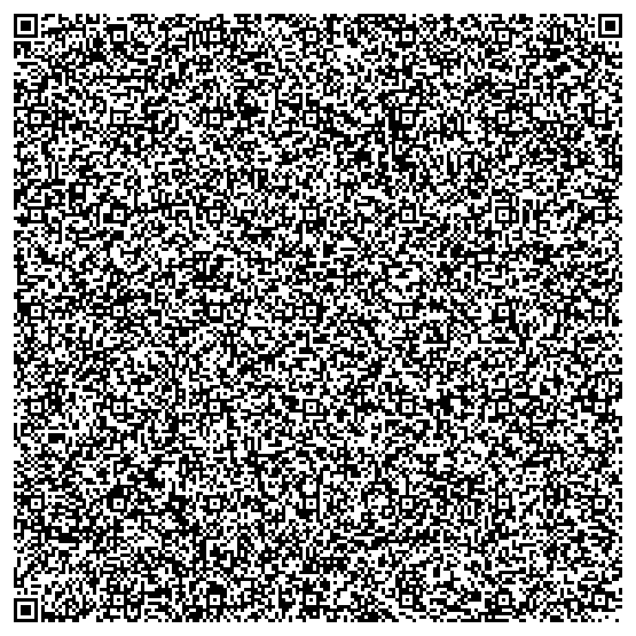

# AI-to-QR-Code

# Project Summary

The aim of this project is to compress models to a point where they can fit on a single QR code, which is 2, 953 bytes. 

# Model Specifications

## Overview

The model, when fully compressed, measures 2,579 bytes and boasts an impressive accuracy of 92% on the MNIST dataset.

*Please note, the QR code representation of the model is currently non-functional due to a bug in the qrcode Python package that corrupts the gzip binary.*

## Architecture

The model architecture consists of two convolutional layers (with a kernel size of 5) followed by a linear layer that connects to the output layer.

## Quantization

To further reduce the model size, 3-bit (0 - 7) quantization aware training has been implemented.

## Pruning

To optimize the model’s efficiency, we have applied L1-norm local pruning on the weights, with a pruning rate of 85% on the convolutional layers and 90% on the linear layer.

